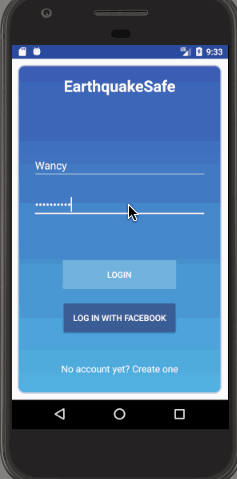

# Final Project - *Earthquake App*

**Earthquake App** is an android app that allows a user to view real time earthquake information. The user can request info by location, time, magnitude on previous earthquakes and get their detailed information. 
Users can notify their friend also they can mark themselves safe after an earthquake happens.

Time spent: **X** hours spent in total

## User Stories

The following functionality is completed:

* [X] User can **create an account** by typing email address and create their own passwords.
* [X] User can also sign in with other social media account, like **facebook**.
* [X] User can get the latest earthquakes update in two ways: view on a **map**, or in a **earthquake list**
* [X] In the earthquake list, useful information are displayed in terms of each earthquake: 
     **Earthquake magnitude**, **Earthquake position**, **Earthquake timestamp**. 
* [X] Earthquakes'magnitudes are displayed in **different colors** based on the **severity**, allow users to differentiate         easily. 
* [X] Earthquakes can also be viewed as **marks on the map** with different colors.
* [X] User can **click** each mark to view the details about where the earthquake took place.
* [X] User can **filter earthquake by location, time and magnitude**
 * [X] User can **find the same filters saved even after closing the app**
* [X] User can click on an earthquake on the list and view it closely, by the camera's centering and zooming in on the map.  
* [X] User can be **redirected to the USGS website** to get extending information on one earthquake. 
* [X] User can **mark safe** if they survived after an earthquake.
* [X] User can **follow friends** to see their safty status.
  
Optionals:
* [X] User can send invites to their freinds to download and installed this app, through emails/social media/,etc
* [ ] User can set **time, location and magnitude of an earthquake to be alerted**
* [X] User can **share about an earthquake happening on social media facebook/twitter**
* [ ] User can set **receive notification when a friend is setting themselves safe**

Bonus:
* [ ] User can get **alert when an earthquake happen around a set radius of a set position**
* [ ] User can get **alert when an earthquake happen around themselves**
* [ ] User can **send SOS info**

[wireframe link](https://www.fluidui.com/editor/live/)

## Video Walkthrough

Here's a walkthrough of implemented user stories:

GIF created with [LiceCap](http://www.cockos.com/licecap/).

## Notes

Describe any challenges encountered while building the app.

## Open-source libraries used

- [Android Async HTTP](https://github.com/loopj/android-async-http) - Simple asynchronous HTTP requests with JSON parsing

## License

    Copyright Rebecca Zhang, Emilie Brisseau, Sarah Wang

    Licensed under the Apache License, Version 2.0 (the "License");
    you may not use this file except in compliance with the License.
    You may obtain a copy of the License at

        http://www.apache.org/licenses/LICENSE-2.0

    Unless required by applicable law or agreed to in writing, software
    distributed under the License is distributed on an "AS IS" BASIS,
    WITHOUT WARRANTIES OR CONDITIONS OF ANY KIND, either express or implied.
    See the License for the specific language governing permissions and
    limitations under the License.
